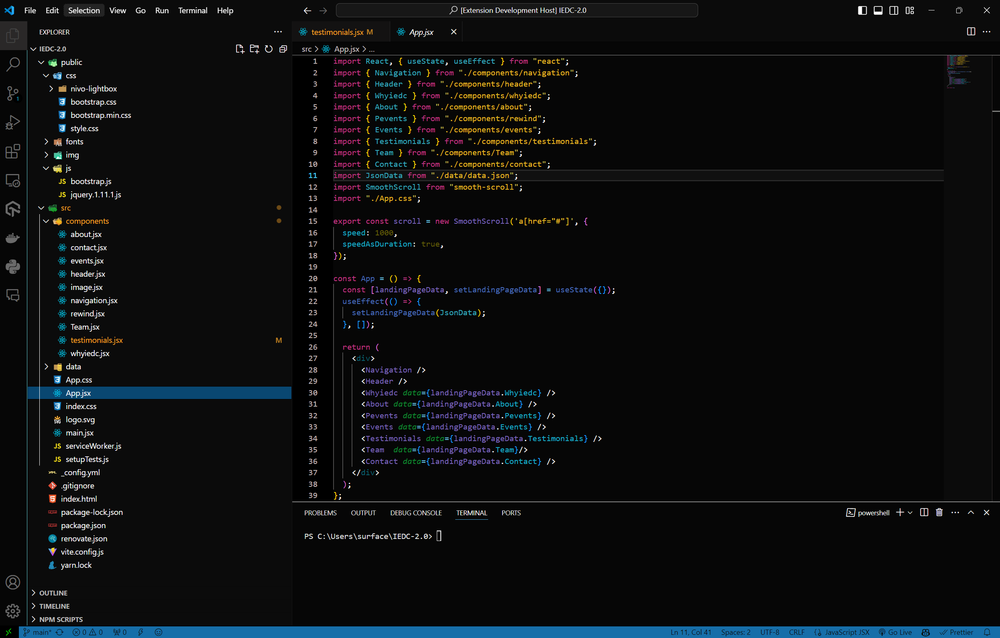

# Dark Theme for Visual Studio Code by Alvin Dennis

## Description

This is a dark theme for Visual Studio Code designed to provide a comfortable coding experience with eye-friendly colors and good readability.

## Installation

1. Launch Visual Studio Code.
2. Go to Extensions in the sidebar.
3. Search for "ShadowSpectrum".
4. Click Install to install the theme.
5. Go to File > Preferences > Color Theme and select "ShadowSpectrum" from the dropdown menu.

## Features

- Dark background with high contrast colors.
- Syntax highlighting optimized for various programming languages.
- Customized colors for different code elements for better readability.
- Support for popular VSCode extensions.

